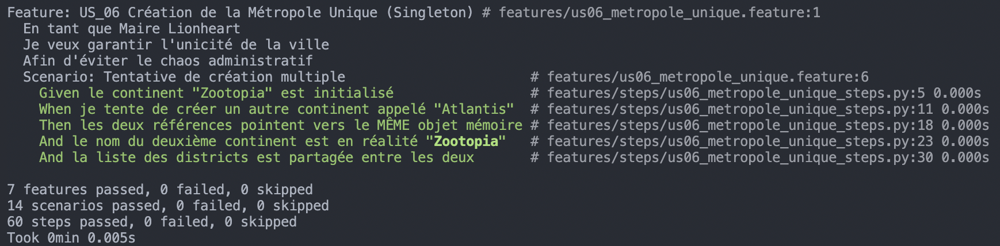
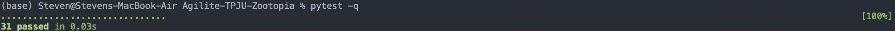

# Zootopia : Une Métropole où la Biologie rencontre la Géographie

*Une fusion architecturale de deux projets en une ville vivante et cohérente.*

---

## 1. Le Contexte : Une Ville à Construire
Notre mission consistait à fusionner deux univers distincts : le monde hiérarchique de la **Géographie** (Continents, Pays) et l'écosystème dynamique de la **Biologie** (Habitats, Animaux). Nous avons choisi l'univers de **Zootopia** comme cadre parfait, car il illustre une société complexe où chaque espèce doit trouver sa place dans un environnement adapté, sous une administration unifiée.

**Objectif :** Créer une méta-structure cohérente permettant aux citoyens-animaux d'évoluer dans des districts géographiques tout en respectant leurs besoins biologiques, avec une contrainte majeure : **modifier le code existant de manière minimale.**

---

## 2. Le Déclencheur : Le Problème des Deux Mondes
Notre principal défi technique était l'incompatibilité entre nos deux systèmes :
-   **Le système "Biologie" (`Habitat`)** parlait le langage des **biotopes** (Désert, Toundra, Forêt).
-   **Le système "Géographie" (`Pays`)** parlait le langage des **districts administratifs** (Sahara Square, Tundratown).

Ces deux mondes devaient communiquer sans que l'un ne modifie profondément le code interne de l'autre.

> *« Comment faire cohabiter le sauvage et l'urbain sans tout casser ? »*

---

## 3. Le Voyage : L'Architecture en Couches de Zootopia

diagramme de classe illustrant les 2 design patterns
### **Niveau 1 : Le Cœur Unique - Le Singleton `Continent`**
Pour garantir l'unicité et la cohérence de la métropole, nous avons instauré **Zootopia comme un Singleton**. Peu importe qui ou quoi l'interroge, il n'existe qu'une seule et unique instance de la ville. C'est la pierre angulaire administrative, le "Continent" qui chapeaute tout.
[Design Pattern Singleton](./src/continent.py) 
* Zootopia est une. Son administration centrale est unique et incontestable, garantissant l'ordre à l'échelle de la métropole. 

### **Niveau 2 : Les Districts - La classe `Pays`**
La ville se divise en **districts climatiques emblématiques** (Tundratown, Sahara Square, Rainforest District...). Chacun est une instance de `Pays`. Dès sa création, un district s'enregistre **automatiquement** auprès de la mairie centrale (`Continent`), s'inscrivant dans la cartographie officielle de Zootopia.

### **Niveau 3 : Le Zonage Urbain - L'Adaptateur `HabitatDistrict` (La Clé de Voûte)**
C'est ici que la fusion devient élégante. Pour relier un `Habitat` biologique à un `Pays` géographique **sans modifier leurs codes d'origine**, nous avons créé un **Design Pattern Adaptateur** : `HabitatDistrict`.
**[Design Pattern Adaptateur](./src/habitat_district.py)** : Classe pivot permettant de lier un `Habitat` à un `Pays` (District) sans modifier le code source original.
*   **Rôle :** Cette classe agit comme un **"permis de zonage"**.
*   **Fonction :** Elle "enveloppe" un `Habitat` (ex: une Banquise) et lui **assigne officiellement un district** (ex: Tundratown). Elle traduit l'espace naturel en zone administrative reconnue.

*Dans la nature, un habitat est libre. À Zootopia, il doit être zoné. Notre adaptateur officialise le biotope, le rattachant juridiquement et logiquement à un district. *

### **Niveau 4 : Les Biotopes Concrets - La classe `Habitat`**
À l'intérieur des districts zonés se trouvent les **habitats réels**, gérés par la classe d'origine `Habitat`. Elle définit le type de milieu (froid, aride...) et garde la **liste des résidents actuels**.

### **Niveau 5 : Les Citoyens - La classe `Animal`**
Au bout de la chaîne, les **citoyens** (Judy Hopps, Nick Wilde...). Ils possèdent une **énergie vitale** et des **besoins spécifiques**.

---

## 4. Le Tournant : La Vie en Société Démystifiée
Grâce à cette architecture en couches, des mécanismes sociaux complexes deviennent simples :

*   **Déménagement (`move_to()`)** : Pour s'installer dans un nouvel habitat, un citoyen paie **10 points d'énergie**, symbolisant l'effort d'intégration et de transport.
*   **Survie :** Le système vérifie en permanence si l'énergie du citoyen **couvre les besoins journaliers** (`daily_energy_need`) de l'habitat de son district. Vivre dans la Toundra est plus coûteux en énergie que dans la Forêt Tempérée.
*   **Traçabilité :** On peut désormais remonter toute la chaîne d'appartenance :  
    `Animal` → `HabitatDistrict` (adaptateur) → `Pays` (District) → `Continent` (Zootopia).

---

## 5. La Résolution : Une Ville Cohérente et Vivante
**Résultat tangible :** Nous avons créé un écosystème logiciel où la géographie structure l'espace et la biologie gère la vie. Zootopia est une entité **unifiée, organisée et dynamique**.

**Transformation technique :** L'utilisation du **pattern Adaptateur** a été la révélation. Il a permis une **fusion propre, évolutive et respectueuse du code existant**, évitant un réécriture massive et des couplages indésirables.

[User Stories](USER_STORIES.md): Ce document détaille les scénarios d'utilisation du système (US), les critères d'acceptation et la correspondance avec les tests fonctionnels Gherkin.

* **Gestion de la fusion**

---
  
[Test unitaire – US05](tests/test_us05_fusion_bio_geo.py) :  Ce script garantit la **non-régression** lors de la fusion des domaines biologique et géographique.  
Il vérifie la chaîne de liaison complète :

**Animal ➔ HabitatDistrict ➔ Pays ➔ Continent**

### Points clés vérifiés :
- **Compatibilité descendante :**  
  L’animal utilise sa méthode originale `move_to` sans aucune modification
  du code source existant.
- **Validation de l’Adaptateur :**  
  L’habitat forestier est correctement adapté pour appartenir au district
  géographique « France ».
- **Intégrité du storytelling :**  
  Un loup vivant dans une forêt est désormais capable de se situer
  géographiquement en France, au sein du continent Zootopia.

---

[Test fonctionnel – US05](features/us05_fusion_bio_geo.feature) : Ce scénario Gherkin valide le comportement métier de la fusion, du point de vue utilisateur.

Il confirme que la chaîne fonctionnelle suivante est opérationnelle :

**Citoyen ➔ Habitat ➔ District ➔ Ville**

La fusion est ainsi validée sans altérer les comportements existants,
conformément aux principes de l’agilité et de la non-régression.

---

[Test unitaire – US06](tests/test_us06_singleton.py) : Ce script valide l’implémentation du **Design Pattern Singleton** pour la classe `Continent`.

### Points clés vérifiés :
- **Identité mémoire :**  
  Vérifie que deux références pointent vers le même objet
  (`c1 is c2`), garantissant l’unicité de la métropole Zootopia en mémoire.
- **Persistance du Singleton :**  
  Confirme que toute tentative de création d’un nouveau continent
  retourne l’instance existante.
- **Soft reset contrôlé :**  
  Valide la possibilité de réinitialiser l’état interne sans perdre
  l’identité de l’objet, assurant la fiabilité des tests successifs.

---

[Test fonctionnel – US06](features/us06_metropole_unique.feature) : Ce scénario BDD valide le **comportement métier** associé au Singleton, du point de vue utilisateur.

Il démontre que :
- plusieurs tentatives de création de continent conduisent à une
  **instance unique**,
- l’identité de la ville reste cohérente,
- les données internes sont partagées entre toutes les références.

Ainsi, le choix architectural du Singleton est pleinement justifié
par un besoin fonctionnel explicite et vérifié par des tests BDD.

## 5.1 Validation par les tests automatisés (BDD & Tests unitaires)

Afin de garantir la conformité du système aux user stories définies,  
l’ensemble des fonctionnalités a été validé par des **tests automatisés**,  
selon deux niveaux complémentaires :

### ✔ Tests Fonctionnels – BDD (Behave)

Les scénarios Behave permettent de valider les **critères d’acceptance**  
de chaque user story du point de vue métier.

**Résultat :**
- 7 features validées
- 14 scénarios exécutés
- 60 steps exécutés
- Aucun échec

Ces tests confirment que les user stories **US_001 à US_06** sont respectées  
et que la fusion entre les domaines biologique et géographique est fonctionnelle  
sans régression.

---

### ✔ Tests Unitaires – Pytest

Les tests unitaires Pytest vérifient la **logique interne des classes**  
et les règles techniques (énergie, calculs, Singleton, adaptateur, etc.).

**Résultat :**
- Tous les tests unitaires sont passés avec succès
- Aucune régression détectée après la fusion des projets

Ces tests garantissent la **robustesse du code**, indépendamment  
des scénarios fonctionnels.

---

## 6. Conclusion : La Leçon de Zootopia
Ce projet démontre que des systèmes complexes et initialement indépendants peuvent **co-évoluer harmonieusement** grâce à une **architecture pensée et des patterns design appropriés**. Comme dans la ville de Zootopia, où prédateurs et proies apprennent à vivre ensemble, nos composants "Géographie" et "Biologie" ont trouvé un langage commun grâce à un adaptateur bien conçu.

> * En code comme en société, l'intégration ne signifie pas l'assimilation, mais la création d'interfaces intelligentes qui préservent l'identité de chacun. *

**En résumé : Zootopia est plus qu'une ville ; c'est une simulation architecturale où chaque couche de code a sa place et son rôle, contribuant à faire vivre une société virtuelle cohérente.**
